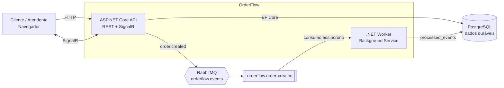
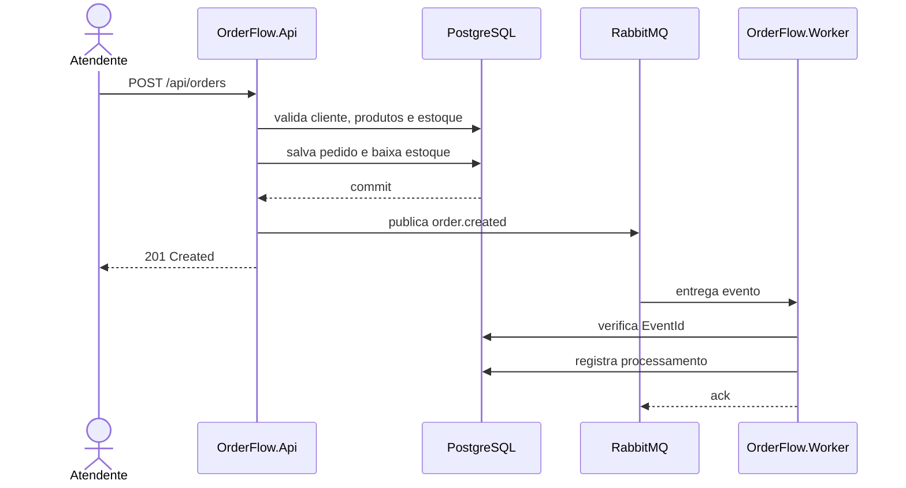
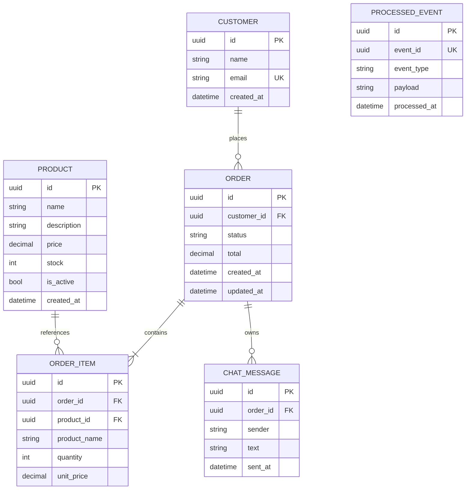

<div align="center">

# OrderFlow

### Plataforma de pedidos com tempo real e processamento assíncrono

O **OrderFlow** é uma aplicação backend criada para demonstrar, em um único projeto, como APIs REST, comunicação em tempo real e arquitetura orientada a eventos trabalham juntas em um ambiente containerizado.

[](#roadmap)
[](https://dotnet.microsoft.com/)
[](https://www.postgresql.org/)
[](https://www.rabbitmq.com/)
[](https://www.docker.com/)
[](https://kubernetes.io/)

[Projeto](#o-projeto) •
[Core](#core-do-projeto) •
[Arquitetura](#arquitetura) •
[Tecnologias](#tecnologias) •
[Roadmap](#roadmap)

</div>

---

## O projeto

O OrderFlow simula a operação de uma loja ou restaurante. O sistema centraliza o catálogo de produtos, clientes, pedidos, estoque, acompanhamento de status e a conversa entre atendimento e cliente.

Seu principal objetivo é explorar problemas reais de arquitetura backend:

- como preservar regras de negócio sem acoplá-las ao framework web;
- como manter dados relacionais consistentes durante a criação de um pedido;
- como enviar atualizações instantâneas apenas aos usuários interessados;
- como retirar tarefas demoradas do ciclo da requisição HTTP;
- como lidar com mensagens repetidas e falhas de processamento;
- como empacotar e executar toda a solução de maneira reproduzível;
- como preparar uma aplicação para testes, observabilidade e implantação.

Mais do que um CRUD, o projeto apresenta três modelos de comunicação usados em aplicações modernas:

| Comunicação | Tecnologia | Uso no OrderFlow |
|---|---|---|
| Síncrona | ASP.NET Core Web API | Catálogo, clientes, pedidos e consultas |
| Tempo real | SignalR | Chat por pedido e atualização instantânea de status |
| Assíncrona | RabbitMQ + Worker .NET | Processamento de eventos em segundo plano |

## Core do projeto

### Produtos e estoque

- cadastro e manutenção do catálogo;
- preço e quantidade disponíveis;
- ativação e desativação lógica;
- validação de estoque durante o pedido;
- baixa de estoque dentro da transação de criação.

### Clientes

- cadastro e consulta de clientes;
- validação e normalização de nome e e-mail;
- relacionamento entre cliente e histórico de pedidos.

### Pedidos

- criação com um ou vários produtos;
- snapshot do nome e preço no item do pedido;
- cálculo do total no domínio;
- persistência transacional do pedido e da baixa de estoque;
- consulta detalhada de pedido e itens;
- fluxo controlado de status:

```text
Created -> Confirmed -> Preparing -> Shipped -> Delivered
    `-------------------------------------------> Cancelled
```

### Chat em tempo real

- uma sala SignalR para cada pedido;
- mensagens entregues somente ao grupo `order:{orderId}`;
- histórico salvo no PostgreSQL;
- recuperação do histórico após atualizar a página;
- notificação instantânea quando o status do pedido muda.

### Processamento assíncrono

- publicação do evento `order.created` pela API;
- roteamento por exchange topic no RabbitMQ;
- fila durable consumida pelo Worker;
- ack manual somente depois do processamento;
- idempotência por `EventId` único;
- proteção contra ciclos infinitos de requeue.

## Arquitetura



### Fluxo de criação de pedido



### Separação em camadas

| Camada | Responsabilidade |
|---|---|
| `OrderFlow.Domain` | Entidades, enums, invariantes e regras centrais |
| `OrderFlow.Application` | DTOs, contratos e casos de uso |
| `OrderFlow.Infrastructure` | EF Core, PostgreSQL, migrations e RabbitMQ |
| `OrderFlow.Api` | Controllers, OpenAPI, health checks, SignalR e interface web |
| `OrderFlow.Worker` | Consumo idempotente e processamento de eventos |
| `OrderFlow.Tests` | Testes unitários e de integração |

O domínio permanece independente de ASP.NET Core, Entity Framework Core e RabbitMQ. Dependências externas ficam nas bordas da aplicação.

## Tecnologias

### Backend

| Tecnologia | Papel |
|---|---|
| C# / .NET 10 | Linguagem, runtime e SDK |
| ASP.NET Core | API REST, Controllers, middlewares e health checks |
| Entity Framework Core | Mapeamento objeto-relacional e migrations |
| SignalR | Comunicação bidirecional em tempo real |
| Worker Service | Processamento contínuo em segundo plano |
| xUnit | Testes automatizados |

### Dados e mensageria

| Tecnologia | Papel |
|---|---|
| PostgreSQL 18 | Persistência relacional e fonte durável da verdade |
| RabbitMQ 4 | Broker de mensagens e desacoplamento assíncrono |
| RabbitMQ.Client 7 | Integração da API e do Worker com o broker |

### Infraestrutura e DevOps

| Tecnologia | Papel |
|---|---|
| Docker | Imagens reproduzíveis da API e do Worker |
| Docker Compose | Ambiente local completo com um comando |
| Kubernetes | Deployments, Services, ConfigMap, Secret, probes e PVC |
| GitHub Actions | Build, testes e publicação de imagens |
| GHCR | Registro das imagens da API e do Worker |
| OpenAPI | Descoberta e documentação dos endpoints |

## Modelo de domínio



## API planejada

| Método | Endpoint | Responsabilidade |
|---|---|---|
| `GET` | `/api/products` | Listar produtos |
| `POST` | `/api/products` | Cadastrar produto |
| `GET` | `/api/products/{id}` | Consultar produto |
| `PUT` | `/api/products/{id}` | Atualizar produto |
| `DELETE` | `/api/products/{id}` | Desativar produto |
| `GET` | `/api/customers` | Listar clientes |
| `POST` | `/api/customers` | Cadastrar cliente |
| `POST` | `/api/orders` | Criar pedido |
| `GET` | `/api/orders/{id}` | Consultar pedido e itens |
| `PATCH` | `/api/orders/{id}/status` | Alterar status |
| `GET` | `/api/orders/{id}/messages` | Recuperar histórico do chat |
| `GET` | `/health` | Verificar saúde da API |
| SignalR | `/hubs/orders` | Chat e notificações por pedido |

## Decisões técnicas

### Persistência é responsabilidade do PostgreSQL

SignalR entrega informações instantaneamente e RabbitMQ distribui trabalhos. O estado permanente permanece no PostgreSQL para que histórico, pedidos e mensagens sobrevivam a reinícios e desconexões.

### O Worker confirma somente depois de processar

O consumo utiliza ack manual. A mensagem só é confirmada depois que o efeito foi executado e o `ProcessedEvent` persistido.

### Eventos precisam ser idempotentes

O mesmo evento pode ser entregue mais de uma vez. Um índice único em `EventId` impede que a repetição gere efeitos duplicados.

### Outbox é uma evolução planejada

No MVP, o evento é publicado depois do commit do pedido. O Outbox Pattern será implementado posteriormente para eliminar a janela de inconsistência entre banco e broker.

### SignalR começa com uma réplica da API

Uma conexão SignalR permanece vinculada a uma instância. O MVP usa uma réplica da API no Kubernetes. A escala horizontal exigirá Redis backplane e sticky sessions ou um serviço gerenciado.

## Estrutura da solução

```text
OrderFlow/
|-- src/
|   |-- OrderFlow.Domain/
|   |-- OrderFlow.Application/
|   |-- OrderFlow.Infrastructure/
|   |-- OrderFlow.Api/
|   `-- OrderFlow.Worker/
|-- tests/
|   `-- OrderFlow.Tests/
|-- .gitignore
|-- PLAN.md
|-- TODO.md
|-- handoff.md
|-- OrderFlow.slnx
`-- README.md
```

Os diretórios `requests`, `k8s`, `docs` e `.github/workflows`, além do `docker-compose.yml`, serão criados nas fases correspondentes.

### Bootstrap executado

A solução e os seis projetos-base foram gerados com o SDK .NET 10:

```powershell
dotnet new sln -n OrderFlow

New-Item -ItemType Directory -Path .\src, .\tests

dotnet new classlib -n OrderFlow.Domain -o .\src\OrderFlow.Domain --framework net10.0 --no-restore
dotnet new classlib -n OrderFlow.Application -o .\src\OrderFlow.Application --framework net10.0 --no-restore
dotnet new classlib -n OrderFlow.Infrastructure -o .\src\OrderFlow.Infrastructure --framework net10.0 --no-restore
dotnet new webapi -n OrderFlow.Api -o .\src\OrderFlow.Api --use-controllers --framework net10.0 --no-restore
dotnet new worker -n OrderFlow.Worker -o .\src\OrderFlow.Worker --framework net10.0 --no-restore
dotnet new xunit -n OrderFlow.Tests -o .\tests\OrderFlow.Tests --framework net10.0 --no-restore
```

Todos os projetos usam `net10.0`. As referências entre camadas foram configuradas, as dependências iniciais foram fixadas e a solução passou por restore, build e teste em 2026-07-21.

### Estado atual da fundação

- `OrderFlow.Domain` permanece sem dependências de infraestrutura;
- `OrderFlow.Application` referencia apenas Domain;
- API e Worker consomem Application e Infrastructure;
- Infrastructure usa Npgsql/EF Core e RabbitMQ.Client;
- a API usa o OpenAPI nativo do ASP.NET Core, com `Microsoft.OpenApi` 2.7.5 fixado por segurança;
- `dotnet restore` e `dotnet build` concluíram sem avisos;
- o teste inicial do template foi aprovado;
- commit técnico da etapa: `371152c`.

## Qualidade e confiabilidade

O projeto será validado com:

- testes unitários das regras de domínio;
- testes de integração com PostgreSQL e RabbitMQ reais;
- teste de isolamento entre grupos SignalR;
- validação de transação e concorrência de estoque;
- Problem Details para respostas de erro consistentes;
- logs estruturados com `OrderId` e `EventId`;
- health checks, readiness e liveness probes;
- análise de dependências vulneráveis;
- build e testes em ambiente limpo no GitHub Actions.

## Execução

O contrato de execução local será:

```powershell
docker compose up -d --build
```

Esse comando disponibilizará:

| Serviço | Endereço |
|---|---|
| Aplicação e chat | `http://localhost:8080` |
| Documento OpenAPI | `http://localhost:8080/openapi/v1.json` |
| Health check | `http://localhost:8080/health` |
| RabbitMQ Management | `http://localhost:15672` |
| PostgreSQL | `localhost:5432` |

> [!NOTE]
> O projeto está em desenvolvimento. As instruções serão liberadas como executáveis depois que a implementação e a validação com Docker Compose forem concluídas.

## Roadmap

- [x] Preparação do ambiente e estrutura da solução;
- [ ] domínio, Entity Framework Core e PostgreSQL;
- [ ] API de produtos, clientes e pedidos;
- [ ] RabbitMQ e Worker idempotente;
- [ ] SignalR e interface de demonstração;
- [ ] Docker Compose;
- [ ] testes, logs e tratamento de erros;
- [ ] Kubernetes local;
- [ ] GitHub Actions e GHCR;
- [ ] documentação visual e release `v1.0.0`.

### Depois do MVP

- Outbox Pattern;
- Dead Letter Queue e retry com backoff;
- autenticação JWT e autorização por pedido;
- Redis backplane;
- OpenTelemetry;
- Helm, Ingress e TLS;
- métricas, dashboards e testes de carga.

## Documentação

| Documento | Conteúdo |
|---|---|
| [PLAN.md](PLAN.md) | Arquitetura, fases, critérios de aceite, riscos e cronograma |
| [TODO.md](TODO.md) | Checklist completo de implementação |
| [handoff.md](handoff.md) | Estado mais recente e próxima ação |
| [Apostila OrderFlow](Apostila_OrderFlow_DotNet_Docker_Kubernetes_PostgreSQL_SignalR_RabbitMQ.pdf) | Material-base do projeto |

## Autor

Desenvolvido por [Mateus Barbosa](https://github.com/barbosamg) como projeto de estudo e portfólio em backend, sistemas distribuídos, containers e DevOps.

---

<div align="center">

**Construindo o fluxo completo: da requisição HTTP ao evento processado.**

</div>
